# Zero-Knowledge Billing

<p align="center">
  
</p>

Application de facturation **local-first** et **zero-knowledge** : le serveur ne stocke jamais le contenu des devis, factures ou documents, uniquement les preuves cryptographiques (hash, signature) et les données nécessaires au fonctionnement (comptes, sauvegarde chiffrée, paiements).

---

## Côté métier : à quoi sert l’application ?

**Zero-Knowledge Billing** est un outil de **facturation et de gestion** pour auto-entrepreneurs, TPE, artisans et professionnels. Elle permet de :

- **Gérer sa société** : nom, SIRET, RCS, capital, siège social, numéro TVA intracommunautaire, logo (Données personnelles).
- **Gérer ses clients** : raison sociale, nom, prénom, email, téléphone, adresse, code postal, ville, SIRET (Ajouter client).
- **Créer des devis** : client, numéro, dates, objet, lignes (désignation, quantité, unité, prix unitaire), réduction, TVA, devise ; mise en page personnalisable (profils de layout).
- **Émettre des factures** : à partir de zéro ou en transformant un devis accepté ; mêmes champs que le devis, avec suivi du statut (signé, payé).
- **Lister et gérer les documents** : liste des devis et factures avec recherche, filtres ; impression / export PDF ; envoi pour **signature par email** (lien de confirmation côté client) ; export des pièces jointes en ZIP.
- **Signer / accepter un document** : le client reçoit un email avec un lien ; en cliquant, il confirme avoir accepté le devis ou la facture (page « Signer / Accepter »).
- **Paiement en ligne** : configuration de **Stripe** (clé secrète) ; après signature d’une facture, le client peut être redirigé vers un paiement Stripe ; suivi du statut payé dans la liste des documents.
- **Enregistrer les achats** : achats / dépenses (fournisseur, catégorie, description, montant HT, TVA, mode de paiement, n° de facture fournisseur) ; preuves d’intégrité comme pour les devis/factures.
- **Vue comptabilité** : sur une période donnée, synthèse des **ventes** (factures) et des **achats**, avec totaux et TVA ; données déchiffrées à la volée après saisie du mot de passe.
- **Coffre-fort** : stockage de documents (justificatifs, contrats, fiches de paie, etc.) associés ou non à un devis/facture ; catégorisation, recherche ; chiffrement côté client ; preuves d’intégrité envoyées au serveur.
- **Sauvegarder et restaurer** : export d’une archive chiffrée (sauvegarde manuelle) ; synchronisation avec le serveur (sauvegarde automatique sous forme de blob chiffré) pour reprendre les données sur un autre appareil ou après effacement du cache.
- **Explorer la base** : page « Explorer la base » pour voir les stores IndexedDB (clients, société, devis, factures, etc.) et un aperçu déchiffré lorsque la clé est chargée.

Toute la donnée métier (clients, société, devis, factures, achats, coffre-fort) est stockée **dans le navigateur** (IndexedDB), **chiffrée** avec une clé dérivée du mot de passe. Le serveur ne voit que les preuves (hash) et les données strictement nécessaires (comptes, backup chiffré, signatures, paiements).

---

## Structure technique

- **frontend/** — PWA Svelte (Vite), IndexedDB, offline-first
- **backend/** — Node.js (Express), PostgreSQL (Prisma), auth, registre de preuves, sauvegarde chiffrée, envoi d’emails (signature), webhooks Stripe, pages de signature et de paiement

---

## Prérequis

- Node.js 18+ (dév local) ou Docker + Docker Compose

---

## Installation et démarrage

### Docker (backend + PostgreSQL)

Seul le **backend + PostgreSQL** tournent dans Docker. Le frontend se lance à part (dev ou hébergement externe).

```bash
cd /chemin/vers/zerok-billing
cp .env.example .env
# Éditer .env : POSTGRES_PASSWORD, SESSION_SECRET, etc.
docker compose up -d --build
# Appliquer les migrations (après le premier up ou après un pull avec de nouvelles migrations)
docker compose run --rm backend npx prisma migrate deploy
```

- Backend : http://localhost:3011 (ou `BACKEND_PORT` dans .env)
- Frontend : à lancer en dev avec `cd frontend && npm run dev` (http://localhost:5173) ou à déployer ailleurs.

Si le build Docker échoue avec une erreur du type « parent snapshot does not exist » :

```bash
chmod +x rebuild-docker.sh
./rebuild-docker.sh
```

Ou manuellement : `docker system prune -a` puis `docker compose build --no-cache` puis `docker compose up -d`.

### Dév local

**Backend**

```bash
cd backend
cp .env.example .env
# Renseigner DATABASE_URL, SESSION_SECRET, etc.
npm install
npx prisma generate
npx prisma db push
npm run dev
```

API : http://localhost:3001 (ou le port configuré).

**Frontend**

```bash
cd frontend
npm install
npm run dev
```

PWA : http://localhost:5173

---

## Où sont les données ?

- **Backend (PostgreSQL)** : comptes utilisateur (email, hash mot de passe, nom, prénom, adresse), sauvegarde chiffrée par utilisateur (`user_backup`), preuves d’intégrité (devis/factures et documents coffre-fort), demandes de signature, résumés facture/paiement (Stripe), configuration paiement (ex. clé Stripe chiffrée). **Aucun contenu lisible des devis, factures, clients ou société.**

- **Frontend (navigateur)** : toute la donnée métier (clients, société, devis, factures, achats, coffre-fort, profils de mise en page) est dans **IndexedDB** (base `zerok-billing`). Devis, factures et documents du coffre-fort sont **chiffrés** (AES-GCM) : en base on voit `payload` + `iv`, pas le JSON en clair.

**Parcourir la base côté front (IndexedDB)** :  
DevTools → Application (Chrome/Edge) ou Stockage (Firefox) → IndexedDB → `zerok-billing` → stores `clients`, `societe`, `devis`, `factures`, `achats`, `meta`, `layoutProfiles`, etc.  
Ou utiliser la page **Explorer la base** dans l’application (aperçu déchiffré si la clé est chargée).

---

## Documentation complémentaire

- **README_STRIPE.md** — Intégration Stripe (paiement, webhooks).
- **docs/SAUVEGARDE_ZERO_KNOWLEDGE.md** — Sauvegarde serveur, sync après déverrouillage, principe zero knowledge.
- Plan d’architecture (marquage cryptographique, identité triple, workflow) : voir le document de spécification du projet.
