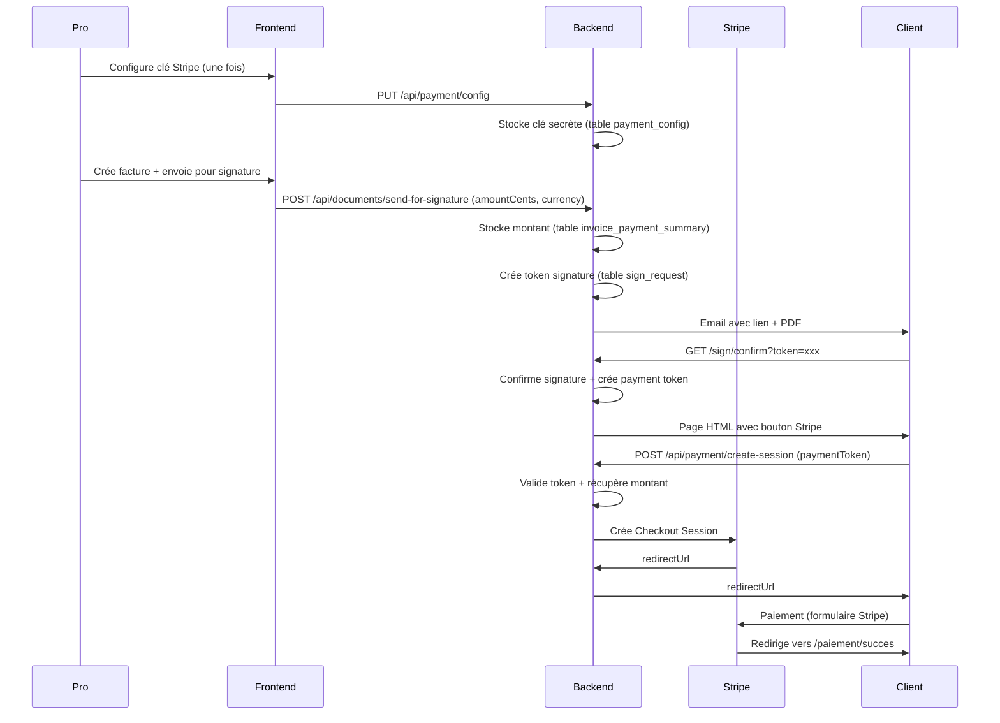

# Paiement en ligne (Stripe)

L'application supporte les paiements en ligne via **Stripe** pour les factures.

## Configuration

1. **Créez un compte Stripe** : https://dashboard.stripe.com/register
2. **Récupérez votre clé secrète** :
   - Mode test : `sk_test_...` (depuis l'onglet **Développeurs** > **Clés API**)
   - Mode production : `sk_live_...` (après activation du compte)
3. **Dans l'application** : menu **Paiement** > saisissez la clé secrète > **Enregistrer**

## Workflow

1. Créez une facture et envoyez-la pour signature (bouton **Envoyer pour signature**)
2. Le client reçoit un email avec le PDF en pièce jointe et un lien pour signer
3. Après signature, le client voit un bouton **Payer avec Stripe** sur la page de confirmation
4. Stripe redirige vers une page de paiement sécurisée (carte bancaire)
5. Après paiement, le client est redirigé vers une page de succès

## Limites

- **Montant minimum** : 0,50 € (limite Stripe)
- **Devise** : EUR uniquement (configurable dans le code : `frontend/src/modules/liste-documents/ListeDocuments.svelte`)
- **Webhooks** : non implémentés (le statut de paiement n'est pas persisté en base). Voir `backend/app.js` (TODO ligne 259) pour ajouter cette fonctionnalité.

## Sécurité

- La clé secrète Stripe est **stockée côté serveur** (table `payment_config`), jamais exposée au frontend
- Les sessions de paiement utilisent un **token unique à usage unique** (durée de vie : 1 heure)
- Les montants sont validés côté serveur avant création de la session Stripe

## Architecture

## Améliorations futures

- [ ] Webhooks Stripe pour persister le statut de paiement en base
- [ ] Support multi-devises (actuellement EUR uniquement)
- [ ] Chiffrement de la clé secrète Stripe en base
- [ ] Support d'autres providers (Mollie, PayPal)
- [ ] Tableau de bord des paiements reçus
