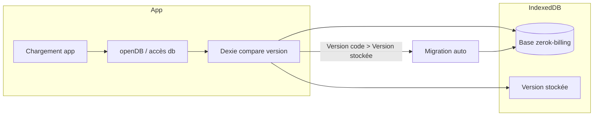
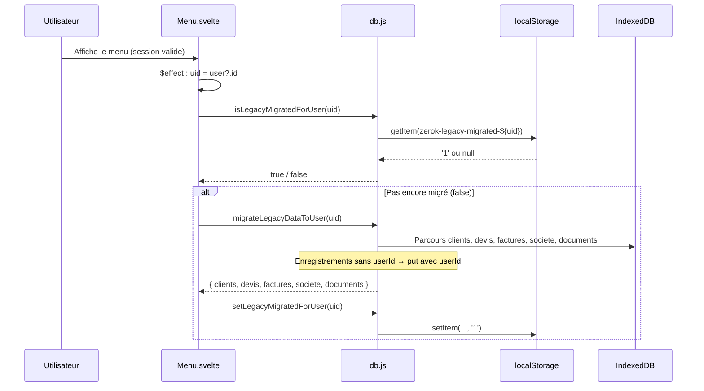
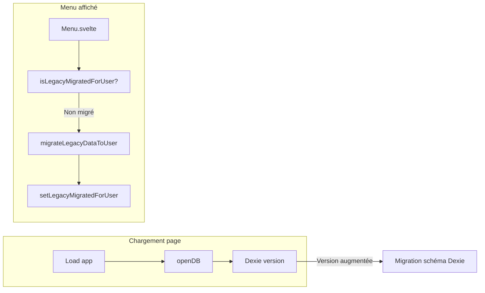

# Migrations côté frontend (IndexedDB)

Ce document décrit comment les migrations sont réalisées dans l’application frontend zerok-billing : **migration du schéma** (Dexie) et **migration des données** (legacy → multi-utilisateurs).

---

## 1. Vue d’ensemble

Deux mécanismes distincts coexistent :

| Type | Rôle | Déclencheur | Fichier |
|------|------|-------------|---------|
| **Migration schéma (Dexie)** | Ajouter / modifier / supprimer des stores ou index IndexedDB | Ouverture de la base (premier `openDB()` après déploiement) | `frontend/src/lib/db.js` |
| **Migration données (métier)** | Attribuer les enregistrements sans `userId` au compte connecté (passage legacy → multi-user) | Premier affichage du Menu pour un utilisateur non encore migré | `frontend/src/lib/db.js` + `Menu.svelte` |

Aucun script à lancer manuellement : tout s’exécute dans le navigateur au chargement de l’app ou à l’affichage du menu.

---

## 2. Migration du schéma (Dexie)

### 2.1 Principe

La base IndexedDB est gérée par **Dexie**. Le schéma (nom des stores, index) et la **version** sont définis dans `db.js` :

```text
db.version(8).stores({ clients: 'id', societe: 'id', devis: 'id', ... })
db.version(9).stores({ documents: 'id, clientId, ... })
```

Dès que le code déclare une **version supérieure** à celle enregistrée dans IndexedDB, Dexie exécute une **migration automatique** : il met à jour les métadonnées et applique les changements (nouveaux stores, nouveaux index, ou suppression de store selon l’API).

### 2.2 Flux



- **Quand** : au premier appel qui ouvre la base (ex. `openDB()`, ou tout accès à `db` qui déclenche l’ouverture).
- **Où** : dans le navigateur, au chargement de la page (ou du worker si un jour la base est ouverte côté worker).
- **Qui** : Dexie, sans code métier supplémentaire (sauf si on ajoute un `db.version(X).upgrade(tx => { ... })` pour des transformations de données lors d’une version).

### 2.3 Modifier le schéma (exemple)

Pour ajouter un store, changer des index ou (selon l’API Dexie) en supprimer un :

1. Incrémenter la version (ex. 9 → 10).
2. Dans `db.js`, ajouter `db.version(10).stores({ ... })` avec le nouveau schéma.
3. Au prochain chargement de l’app, Dexie appliquera la migration.

Les données existantes dans les stores non modifiés sont conservées.

---

## 3. Migration des données (legacy → userId)

### 3.1 Contexte

Après passage en **multi-utilisateurs**, chaque enregistrement (clients, devis, factures, societe, documents) doit être rattaché à un `userId`. Les anciennes données n’avaient pas de `userId` (mode « un seul utilisateur »). La migration **attribue** ces enregistrements au compte actuellement connecté.

### 3.2 Garde « une fois par utilisateur »

La migration ne doit pas être relancée à chaque affichage du menu. Un marqueur dans **localStorage** indique si l’utilisateur a déjà été migré :

- Clé : `zerok-legacy-migrated-${userId}`
- Valeur : `'1'` après migration réussie

Fonctions dans `db.js` :

- `isLegacyMigratedForUser(userId)` : lit le localStorage, retourne `true` si déjà migré.
- `setLegacyMigratedForUser(userId)` : écrit `'1'` après une migration réussie.

### 3.3 Déclenchement



- **Quand** : à l’affichage du Menu, dans un `$effect` qui vérifie `user?.id` et `isLegacyMigratedForUser(uid)`.
- **Condition** : si `isLegacyMigratedForUser(uid)` est `false`, on appelle `migrateLegacyDataToUser(uid)` puis `setLegacyMigratedForUser(uid)`.
- **Où** : `Menu.svelte` (effet) + `db.js` (logique et accès IndexedDB / localStorage).

### 3.4 Contenu de la migration (métier)

```mermaid
flowchart TB
  subgraph migrateLegacyDataToUser
    A[Pour chaque store concerné]
    B[toArray]
    C[Filtrer enregistrements sans userId]
    D[put avec userId]
    E[Societe : renommer id en societe-${userId}]
  end
  A --> B
  B --> C
  C --> D
  C --> E
```

Stores traités (dans l’ordre actuel du code) :

- **clients** : ajout de `userId` à chaque enregistrement sans `userId`, puis `put`.
- **devis** : idem.
- **factures** : idem.
- **societe** : enregistrement legacy `id: 'societe'` → nouveau `id: 'societe-${userId}'` + `userId`, puis `put` et `delete` de l’ancien id.
- **documents** : ajout de `userId` à chaque enregistrement sans `userId`, puis `put`.

La fonction retourne un objet de comptage : `{ clients, devis, factures, societe: boolean, documents }`. Aucun store `layoutProfiles` n’est plus migré (éviction layout, phase 2).

---

## 4. Synthèse : qui fait quoi, quand



- **Migration schéma** : automatique à l’ouverture de la base (Dexie).
- **Migration données** : une fois par utilisateur, au premier affichage du menu, protégée par localStorage.

---

## 5. Fichiers concernés

| Fichier | Rôle |
|---------|------|
| `frontend/src/lib/db.js` | Définition Dexie (version, stores), `openDB`, `migrateLegacyDataToUser`, `isLegacyMigratedForUser`, `setLegacyMigratedForUser` |
| `frontend/src/modules/menu/Menu.svelte` | `$effect` qui appelle la migration legacy si `!isLegacyMigratedForUser(uid)` puis `setLegacyMigratedForUser(uid)` |

Aucun autre module ne déclenche ces migrations. Les scripts de build ou de déploiement n’ont pas à exécuter de migration : tout se fait côté client.
