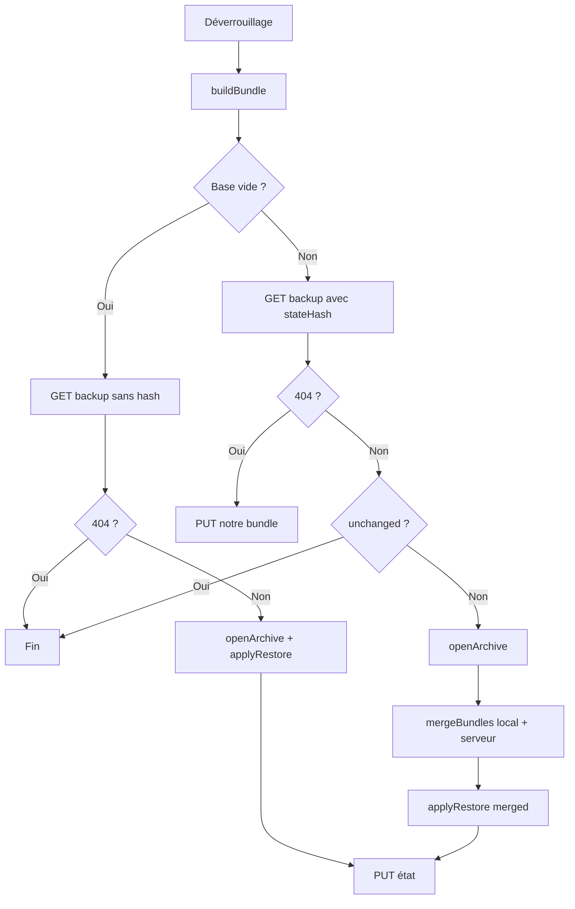

# Sauvegarde serveur et Zero Knowledge

Ce document décrit le mécanisme de sauvegarde des données sur le serveur et explique pourquoi il conserve le modèle **zero knowledge** : le serveur ne peut jamais lire le contenu des devis, factures, clients ou société.

> Dernière mise à jour : 2026-03-01 — Conflits/merge, deux KDF, limites (backup N-1, pas d'offline).

---

## Schéma : sync après déverrouillage (Mermaid)



- **Base vide** : on restaure le blob serveur tel quel.
- **Base non vide + hash différent** : on fusionne local et serveur par id (serveur gagne en conflit), puis on applique le bundle fusionné.
- **Preuves** : `cleanupDocumentProofs` uniquement si au moins un doc en local ; liste vide côté backend = ne rien supprimer.

---

## 1. Pourquoi une sauvegarde serveur ?

Les données (devis, factures, clients, société) sont stockées **côté client** (IndexedDB), chiffrées avec une clé dérivée du mot de passe. La sauvegarde serveur couvre trois cas :

1. **Cache effacé** : l'utilisateur vide son navigateur → les données sont récupérées depuis le serveur au prochain déverrouillage.
2. **Mode privé** : IndexedDB souvent vidé à la fermeture → à la prochaine ouverture, le blob chiffré est restauré.
3. **Multiposte** : l'utilisateur se connecte sur un **autre PC** → la BDD locale est vide → les données sont automatiquement restaurées depuis le serveur (voir § 6).

---

## 2. Principe : archive chiffrée, serveur « aveugle »

- L'**archive** (devis, factures, clients, société) est construite et **chiffrée côté client** avec le mot de passe de l'utilisateur (même schéma que l'export manuel `.zerok-archive`, via `createArchive`).
- Seul le **blob chiffré** est envoyé au serveur. Le serveur stocke ce blob tel quel dans la table `user_backup`.
- La **clé de déchiffrement** ne quitte jamais le client (dérivée du mot de passe en local via PBKDF2). Le serveur ne la connaît pas et **ne peut pas déchiffrer** l'archive.
- En plus du blob, le client envoie un **hash SHA-256** du bundle canonique (avant chiffrement) pour permettre la détection des changements sans transférer le contenu.

**Résultat : zero knowledge** — le serveur ne « sait » rien du contenu ; il stocke et renvoie un bloc de données illisibles pour lui.

---

## 3. Sync à l'ouverture de session (syncAfterUnlock)

Après déverrouillage du coffre, le front sait si la BDD locale est **vide** ou **pleine**.

### 3.1 BDD locale vide (nouveau PC, cache effacé, mode privé)

```
GET /api/backup  (sans paramètre de hash)
       │
       ├── 404 → pas de sauvegarde sur le serveur → rien à faire
       │
       └── 200 + { payload, stateHash }
               │
               ▼
         openArchive(payload, password)  ← déchiffrement local
               │
               ▼
         applyRestore(uid, bundle)  ← réhydrate IndexedDB
               │
               ▼
         _putCurrentState()  ← recalcule le hash du bundle réellement écrit
                               et met à jour le stateHash sur le serveur
               │
               ▼
         syncResultStore = 'restored_empty'
```

**Pourquoi `_putCurrentState` après la restauration ?** Le hash envoyé au serveur doit correspondre exactement au contenu réel d'IndexedDB, qui peut différer légèrement du bundle original (ex. champs `createdAt` recréés par `addDevis`/`addFacture`). Sans ce réalignement, chaque rechargement déclencherait une fausse restauration.

### 3.2 BDD locale non vide

```
computeStateHash(bundle)  → hash local
       │
       ▼
GET /api/backup?hash=<hash>
       │
       ├── 404 → serveur vide → PUT /api/backup (première sauvegarde)
       │
       ├── 200 { unchanged: true } → local = serveur → rien à faire
       │                              syncResultStore = 'unchanged'
       │
       └── 200 + { payload, stateHash } → fusion local + serveur
               │
               ▼
         openArchive → mergeBundles(local, serveur) → applyRestore(merged) + _putCurrentState
               │
               ▼
         syncResultStore = 'restored_overwritten'
```

---

## 4. Événements qui déclenchent un envoi (PUT /api/backup)

Pour que le serveur reste à jour, une nouvelle archive est envoyée en arrière-plan après chaque **modification** locale (avec debounce 5 s pour regrouper les changements rapides) :

| Événement | Module |
|----------|--------|
| Création / modification / suppression d'un devis | `CreerDevis.svelte`, `ListeDocuments.svelte` |
| Création / modification / suppression d'une facture | `Facture.svelte`, `ListeDocuments.svelte` |
| Ajout / modification / suppression d'un client | `AjouterClient.svelte` |
| Modification des données société | `DonneesPersonnelles.svelte` |
| Import manuel d'une archive | `SauvegarderRestaurer.svelte` |
| Bouton « Sauvegarder maintenant » | `SauvegarderRestaurer.svelte` |

---

## 5. Pourquoi ça reste Zero Knowledge ?

| Élément | Côté client | Côté serveur |
|--------|-------------|--------------|
| Mot de passe | Saisi et utilisé pour dériver la clé + chiffrer l'archive | Jamais envoyé (hors auth login) |
| Clé de déchiffrement | Dérivée en local (PBKDF2), gardée en mémoire | Ne la reçoit jamais |
| Données en clair | Déchiffrées uniquement dans le navigateur | Ne les voit jamais |
| Blob sauvegarde | Chiffré avant envoi (AES-GCM) | Reçu et stocké tel quel, illisible |
| Hash état | Calculé localement sur le bundle canonique | Stocké comme fingerprint, opaque |

Le serveur ne peut pas :
- déchiffrer l'archive (pas de clé),
- lire le contenu des devis, factures, clients ou société,
- ni déduire d'informations sur le contenu à partir du blob (chiffrement fort AES-GCM).

---

## 6. Multiposte (power-up)

La sauvegarde serveur rend l'application **multiposte** de façon transparente.

### Scénario : même utilisateur, PC différent

```
PC 1 (données présentes)
  └─ Modification → scheduleBackupUpload → PUT /api/backup (blob chiffré)

PC 2 (nouveau / IndexedDB vide)
  └─ Login ou rechargement
  └─ Unlock → saisie du mot de passe (MÊME mot de passe que PC 1)
  └─ syncAfterUnlock détecte BDD locale vide
  └─ GET /api/backup → blob chiffré
  └─ openArchive(blob, password) → déchiffrement avec le même mot de passe
  └─ applyRestore → IndexedDB réhydraté
  └─ Menu disponible avec toutes les données de PC 1
```

### Prérequis multiposte

- **Même mot de passe** sur tous les postes (la clé de chiffrement est dérivée du mot de passe + un sel lié au compte).
- Lors de la première restauration d'un backup serveur sur un nouveau poste, le bundle contient désormais le `keyDerivationSalt` d'origine :
  - ce sel est écrit dans l'IndexedDB locale,
  - la clé est re-dérivée à partir du mot de passe + ce sel,
  - tous les postes partagent alors **le même sel et la même clé de chiffrement locale** pour ce compte.
- Le sel voyage uniquement **dans l'archive chiffrée** (blob backup) et n'est jamais envoyé en clair hors de ce contexte.

### Sync bidirectionnelle

- PC 2 modifie des données → PUT → serveur mis à jour.
- PC 1 recharge → hash local différent du serveur → serveur fait foi → PC 1 se met à jour.

La synchronisation se fait **à chaque déverrouillage**. Ce n'est pas du temps réel (pas de WebSocket), mais suffit pour un usage nomade classique (PC bureau vs PC portable, par exemple).

### Conflits et stratégie « serveur fait foi »

- **Un compte = un utilisateur = une adresse mail.** Le scénario de conflit sur le **même id** (deux postes modifiant simultanément le même devis/facture) reste très rare.
- Le modèle multiposte repose sur une règle simple : **au déverrouillage, le serveur fait foi** :
  - si le hash local == hash serveur → rien à faire ;
  - si le hash local != hash serveur → on télécharge le blob et on restaure l'état serveur sur le poste courant.
- Il n'y a plus de logique de merge par id côté backup serveur : la résolution de conflit reste « dernier déverrouillage gagne » pour un même id, ce qui est acceptable dans le modèle d'usage (pas de multitâche concurrent sur le même document).
- **Pas de mode offline prévu** : l'accès à l'interface nécessite une session backend. Pas de travail durable sans connexion, donc pas de conflits longs « offline ».

**En résumé** : pour le backup serveur, le modèle actuel est « serveur fait foi » avec état canonique unique par utilisateur, et restauration automatique à chaque déverrouillage.

---

## 7. Dérivations de clé (local vs archive)

Il existe **deux dérivations de clé distinctes** à partir du mot de passe :

| Usage | Salt | Où | Rôle |
|-------|------|-----|------|
| **IndexedDB locale** | `keyDerivationSalt` (propre à chaque poste) | Stocké en local | Chiffre/déchiffre les données dans le navigateur (devis, factures, clients, etc.). |
| **Archive / backup serveur** | Salt dans le payload (fichier ou blob) | Envoyé avec l'archive | Dérivé du mot de passe + ce salt → clé d'archivage. Permet d'ouvrir la même archive sur un autre poste. |

- La **clé locale** ne sert qu'à sécuriser le stockage sur la machine ; elle n'est pas partagée.
- La **clé d'archive** est recalculée à chaque ouverture (mot de passe + salt de l'archive), ce qui rend l'archive **portable** : même mot de passe sur un autre PC → même clé d'archivage → déchiffrement OK, même si le `keyDerivationSalt` local de ce PC est différent.

---

## 8. Limites et évolutions possibles

- **Backup N-1 côté serveur** : aujourd'hui, un PUT écrase le blob précédent. En cas de bug qui uploade un blob corrompu ou vide, il n'y a pas de filet de sécurité. Une évolution utile serait de conserver une version précédente (N-1) et de permettre une restauration par l'admin ou l'utilisateur en cas de problème.
- **Sync non temps réel** : le dernier à déverrouiller « gagne » pour un même id ; à documenter clairement si on expose le comportement à l'utilisateur (ex. message sur la page Sauvegarder / Restaurer).

---

## 9. Architecture des fichiers

| Fichier | Rôle |
|---------|------|
| `frontend/src/lib/backupSync.js` | Orchestrateur : syncAfterUnlock, scheduleBackupUpload, uploadBackupNow |
| `frontend/src/lib/backupApi.js` | Appels API : getBackup, putBackup |
| `frontend/src/lib/backupStateHash.js` | Hash canonique du bundle (sortKeysDeep + SHA-256) |
| `frontend/src/lib/restore.js` | Restauration locale : applyRestore(uid, bundle) |
| `frontend/src/lib/createArchive.js` | Création de l'archive chiffrée |
| `frontend/src/lib/openArchive.js` | Déchiffrement d'une archive |
| `backend/routes/secure.js` | Routes GET et PUT /api/backup |
| `backend/prisma/schema.prisma` | Modèle UserBackup |
