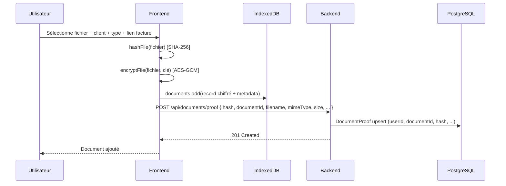
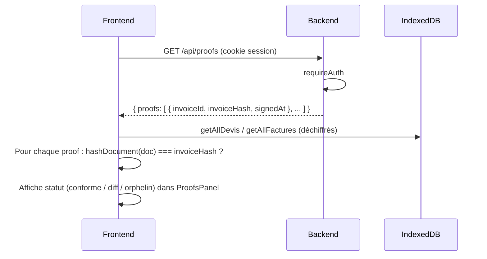

# Index des schémas et diagrammes

Ce document recense les schémas du projet zerok-billing, leur emplacement et leur objectif. Pour les diagrammes Mermaid, une prévisualisation est possible dans l’IDE (extension Mermaid) ou sur GitHub/GitLab.

---

## 1. Schémas disponibles

| Document / fichier | Format | Emplacement | Objectif |
|-------------------|--------|-------------|----------|
| **schema.drawio** | Draw.io | `docs/schema.drawio` | Architecture 3-tiers : Backend (Express, Auth, Session, Proof, DocumentProof), Frontend (Svelte, modules), Database (PostgreSQL, IndexedDB). À ouvrir avec Draw.io. |
| **schemaMermaid.svg** | SVG (export Mermaid) | `frontend/src/assets/schemaMermaid.svg` | Schéma détaillé (workflow ou architecture). Peut être référencé dans l’app ou la doc. |
| **WORKFLOWS.md** | ASCII | `docs/WORKFLOWS.md` | Flux au démarrage, login, dérivation de clé, distinction chiffrement / hash. Diagrammes ASCII conformes au code. |
| **auth-session-derivation-cle.md** | Mermaid | `docs/auth-session-derivation-cle.md` | Connexion/session, dérivation de clé (déverrouillage), stockages, déconnexion. |
| **MIGRATIONS_FRONTEND.md** | Mermaid | `docs/MIGRATIONS_FRONTEND.md` | Migrations Dexie (schéma) et migration métier legacy (migrateLegacyDataToUser). |
| **REFONTE_LAYOUTS_FIXES.md** | ASCII + tableaux | `docs/REFONTE_LAYOUTS_FIXES.md` | Couches UI / rendu / export / données et plan des phases (A–F). |

**Recommandation** : Exporter `schema.drawio` en PNG ou SVG pour consultation rapide sans outil (ex. `docs/schema.svg`). Les diagrammes Mermaid dans les `.md` sont versionnables et prévisualisables directement.

---

## 2. ERD – Relations de données (Mermaid)

Modèle conceptuel : backend (PostgreSQL) et frontend (IndexedDB).

```mermaid
erDiagram
  User ||--o{ Proof : "détient"
  User ||--o{ DocumentProof : "détient"
  User ||--o| SignRequest : "crée"
  Invoice ..> Proof : "hash vérifié par"
  Document ..> DocumentProof : "hash vérifié par"

  User {
    string id PK
    string email
    string passwordHash
    string recoverySalt
    string recoveryKeyCheck
  }

  Proof {
    string id PK
    string userId FK
    string invoiceId
    string invoiceHash
    datetime signedAt
  }

  DocumentProof {
    string id PK
    string userId FK
    string documentId FK
    string documentHash
    string filename
    string mimeType
    int size
  }

  SignRequest {
    string id PK
    string userId FK
    string token
    string email
    datetime expiresAt
  }

  Invoice {
    string id
    string type "devis|facture"
  }

  Document {
    string id
    string clientId
    string linkedInvoiceId
    string type
  }
```

- **Backend (PostgreSQL)** : User, Proof, DocumentProof, SignRequest (et Session via connect-pg-simple).
- **Frontend (IndexedDB)** : clients, societe, devis, factures, documents, meta. Les devis/factures sont chiffrés (payload + iv) ; les documents du coffre ont un hash envoyé au backend pour DocumentProof.

---

## 3. Séquence – Upload document coffre-fort et preuve



- Le contenu du fichier ne quitte jamais le frontend (chiffré en local).
- Le backend ne stocke que le hash et les métadonnées techniques pour la preuve d’intégrité.

---

## 4. Séquence – Vérification des preuves (intégrité)



- Les preuves côté serveur sont comparées au hash local calculé sur le document déchiffré (devis ou facture).
- Permet de détecter une incohérence entre le contenu local et ce qui a été signé/enregistré.
