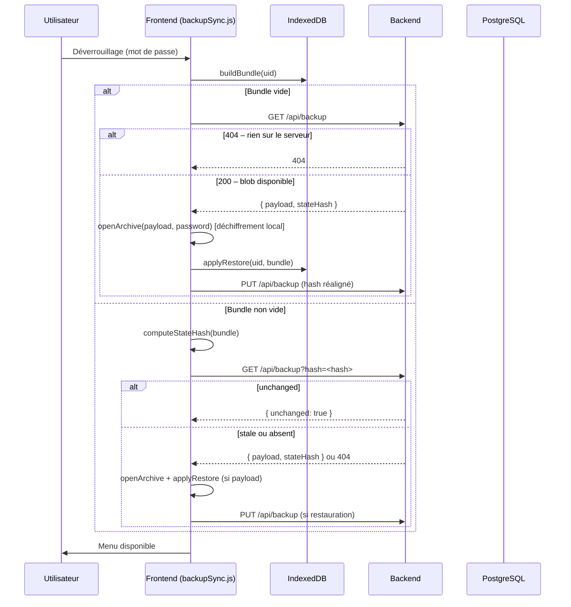
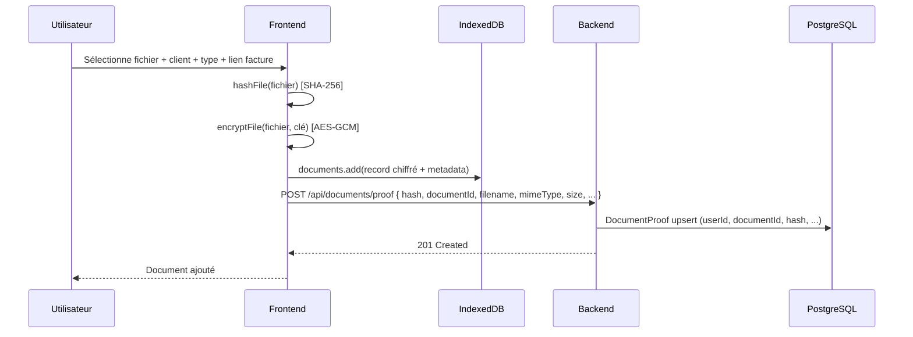
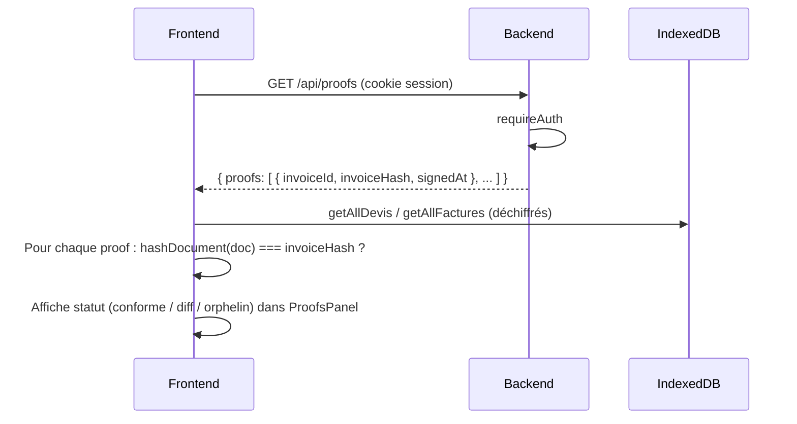

# Index des schémas et diagrammes

Ce document recense les schémas du projet zerok-billing, leur emplacement et leur objectif.

> Dernière mise à jour : 2026-02-27 — Ajout du modèle `UserBackup` et des séquences backup/multiposte.

---

## 1. Schémas disponibles

| Document / fichier | Format | Emplacement | Objectif |
|-------------------|--------|-------------|----------|
| **schema.drawio** | Draw.io | `docs/schema.drawio` | Architecture 3-tiers : Backend (Express, Auth, Session, Proof, DocumentProof, UserBackup), Frontend (Svelte, modules), Database (PostgreSQL, IndexedDB). |
| **schemaMermaid.svg** | SVG (export Mermaid) | `frontend/src/assets/schemaMermaid.svg` | Schéma détaillé (workflow ou architecture). |
| **WORKFLOWS.md** | ASCII | `docs/WORKFLOWS.md` | Flux au démarrage, login, dérivation de clé, backup sync, multiposte. |
| **auth-session-derivation-cle.md** | Mermaid | `docs/auth-session-derivation-cle.md` | Connexion/session, dérivation de clé, backup sync, déconnexion. |
| **MIGRATIONS_FRONTEND.md** | Mermaid | `docs/MIGRATIONS_FRONTEND.md` | Migrations Dexie et migration métier legacy. |
| **SAUVEGARDE_ZERO_KNOWLEDGE.md** | ASCII + tableaux | `docs/SAUVEGARDE_ZERO_KNOWLEDGE.md` | Sauvegarde serveur chiffrée, multiposte, export manuel. |

---

## 2. ERD – Relations de données (Mermaid)

Modèle conceptuel : backend (PostgreSQL) et frontend (IndexedDB).

```mermaid
erDiagram
  User ||--o{ Proof : "détient"
  User ||--o{ DocumentProof : "détient"
  User ||--o| SignRequest : "crée"
  User ||--o| UserBackup : "possède"
  Invoice ..> Proof : "hash vérifié par"
  Document ..> DocumentProof : "hash vérifié par"

  User {
    string id PK
    string email
    string passwordHash
    string recoverySalt
    string recoveryKeyCheck
  }

  UserBackup {
    string id PK
    string userId FK "UNIQUE"
    string payload "Archive chiffrée (TEXT) – opaque pour le serveur"
    string stateHash "SHA-256 du bundle canonique (côté client)"
    datetime updatedAt
  }

  Proof {
    string id PK
    string userId FK
    string invoiceId
    string invoiceHash
    datetime signedAt
  }

  DocumentProof {
    string id PK
    string userId FK
    string documentId FK
    string documentHash
    string filename
    string mimeType
    int size
  }

  SignRequest {
    string id PK
    string userId FK
    string token
    string email
    datetime expiresAt
  }

  Invoice {
    string id
    string type "devis|facture"
  }

  Document {
    string id
    string clientId
    string linkedInvoiceId
    string type
  }
```

- **Backend (PostgreSQL)** : User, Proof, DocumentProof, SignRequest, UserBackup (et Session via connect-pg-simple).
- **Frontend (IndexedDB)** : clients, societe, devis, factures, documents, meta. Les devis/factures sont chiffrés (payload + iv). Le coffre (`documents`) a un hash envoyé au backend pour DocumentProof.
- **UserBackup** : le serveur stocke un blob opaque (archive chiffrée complète) et son hash. Il ne peut pas déchiffrer ce contenu.

---

## 3. Séquence – Sync backup au déverrouillage



---

## 4. Séquence – Upload document coffre-fort et preuve



- Le contenu du fichier ne quitte jamais le frontend (chiffré en local).
- Le backend ne stocke que le hash et les métadonnées pour la preuve d'intégrité.

---

## 5. Séquence – Vérification des preuves (intégrité)



- Les preuves côté serveur sont comparées au hash local calculé sur le document déchiffré.
- Permet de détecter une incohérence entre le contenu local et ce qui a été signé.
