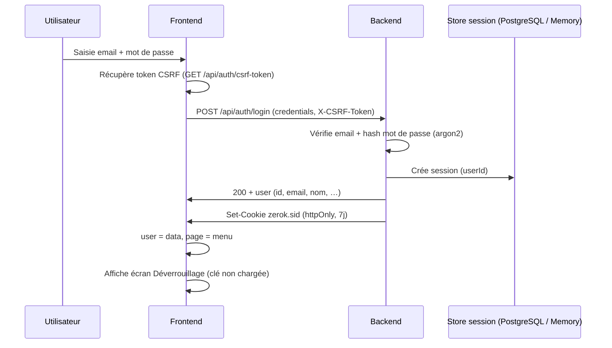
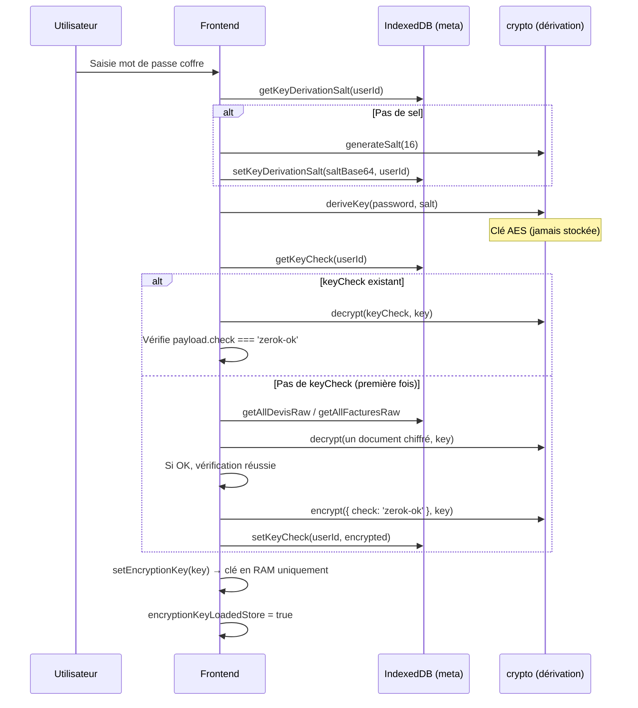
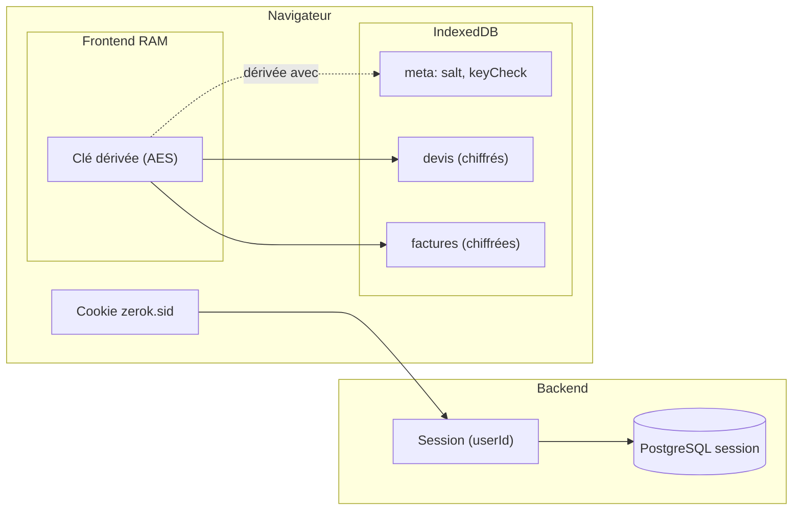
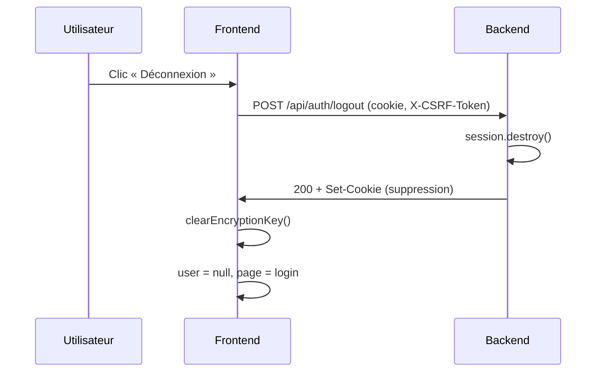

# Auth, session et dérivation de clé

Schémas du flux d’authentification, de session et de déverrouillage (dérivation de la clé de chiffrement).

---

## 1. Connexion et session

- **Session** : cookie `zerok.sid`, durée 7 jours. Côté serveur : table `session` (PostgreSQL si `DATABASE_URL`) ou MemoryStore.
- **CSRF** : token en session, envoyé en header `X-CSRF-Token` sur les requêtes modifiantes.

---

## 2. Dérivation de la clé (déverrouillage coffre)

- **Stocké en IndexedDB (store `meta`)** :  
  - `keyDerivationSalt-{userId}` : sel en base64 (clair).  
  - `keyCheck-{userId}` : `{ payload, iv }` = chiffré de `{ check: 'zerok-ok' }` avec la clé dérivée.
- **Non stocké** : la clé dérivée vit uniquement en mémoire (`_encryptionKey` dans `dbEncrypted.js`). Fermeture d’onglet ou rechargement → clé perdue → il faut redéverrouiller (retaper le mot de passe).

---

## 3. Vue d’ensemble des stockages

- **Cookie** : identifie la session côté backend.  
- **Clé** : uniquement en RAM ; dérivée à partir du mot de passe + sel (meta).  
- **IndexedDB** : sel et keyCheck (meta), devis/factures chiffrés avec la clé dérivée.

---

## 4. Déconnexion

- Côté serveur : session détruite, cookie invalidé.  
- Côté frontend : clé effacée de la RAM, utilisateur ramené à l’écran de login.
