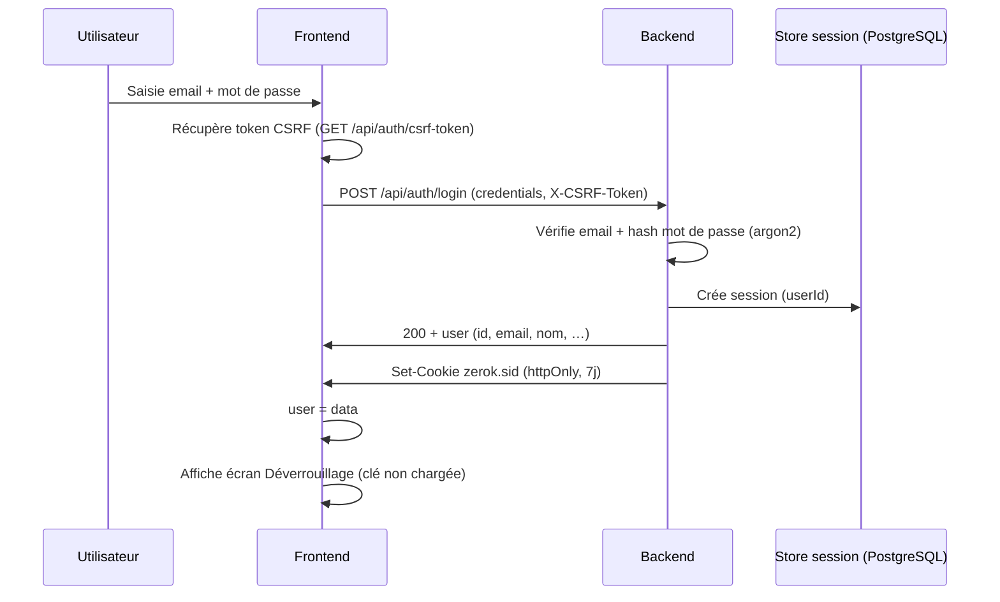
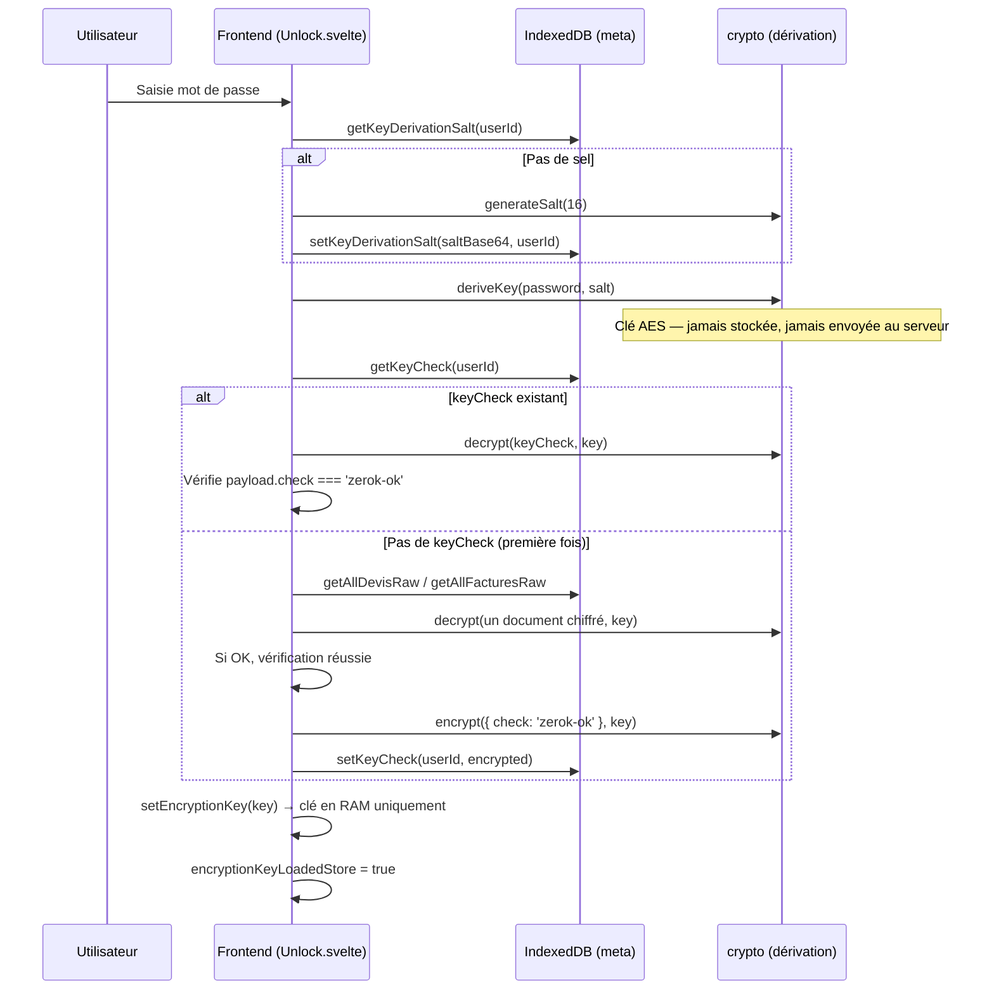
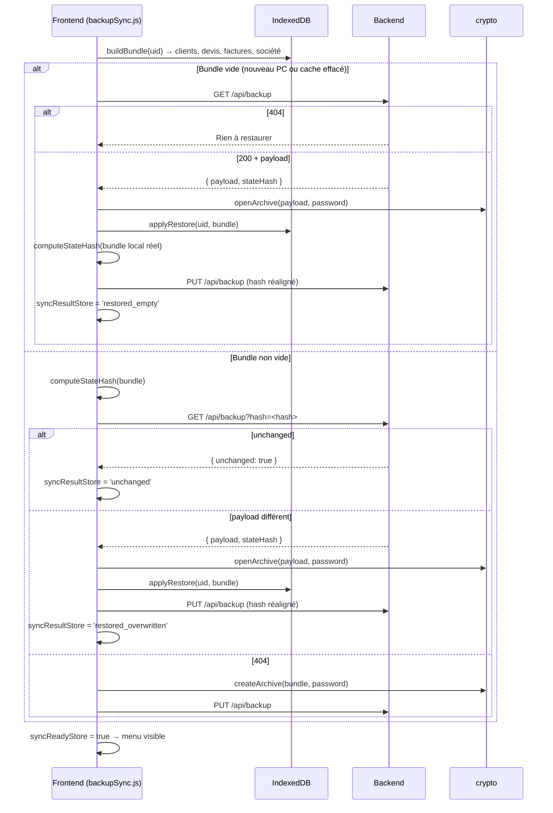
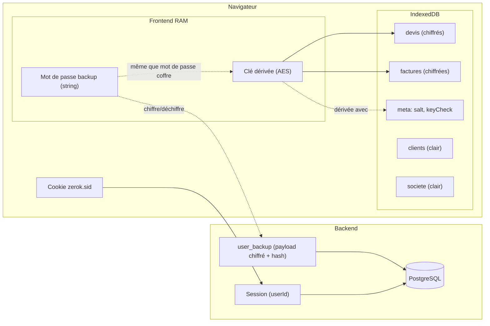
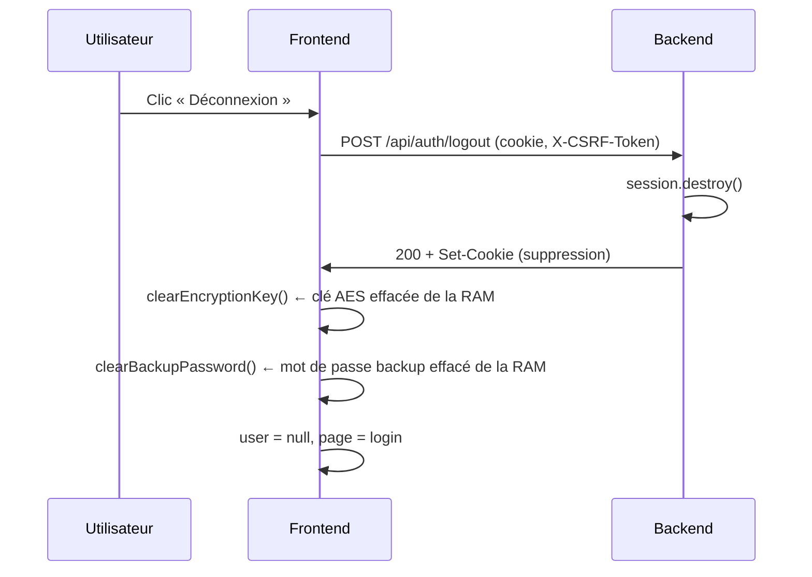

# Auth, session et dérivation de clé

Schémas du flux d'authentification, de session, de déverrouillage et de synchronisation backup.

> Dernière mise à jour : 2026-02-27 — Ajout de la sync backup post-déverrouillage et mise à jour de la déconnexion.

---

## 1. Connexion et session

- **Session** : cookie `zerok.sid`, durée 7 jours. Côté serveur : table `session` (PostgreSQL, via `connect-pg-simple`).
- **CSRF** : token en session, envoyé en header `X-CSRF-Token` sur les requêtes modifiantes.

---

## 2. Dérivation de la clé (déverrouillage)

- **Stocké en IndexedDB (store `meta`)** :
  - `keyDerivationSalt-{userId}` : sel en base64 (clair).
  - `keyCheck-{userId}` : `{ payload, iv }` = chiffré de `{ check: 'zerok-ok' }` avec la clé dérivée.
- **Non stocké** : la clé dérivée vit uniquement en mémoire (`_encryptionKey` dans `dbEncrypted.js`). Fermeture d'onglet ou rechargement → clé perdue → redéverrouillage requis.

---

## 3. Sync backup post-déverrouillage

Après la dérivation de clé, `syncAfterUnlock(uid, password)` est appelé (avec `await`) avant d'afficher le menu.

**Point clé zero-knowledge** : le serveur reçoit uniquement un blob opaque (archive chiffrée AES-GCM) et un hash SHA-256 du bundle canonique. Il ne peut pas déchiffrer le contenu.

---

## 4. Vue d'ensemble des stockages

- **Cookie** : identifie la session côté backend.
- **Clé AES** : uniquement en RAM ; dérivée à partir du mot de passe + sel (meta).
- **Mot de passe backup** : gardé en mémoire le temps de la session pour pouvoir chiffrer/déchiffrer les archives envoyées ou reçues du serveur.
- **IndexedDB** : sel et keyCheck (meta), devis/factures chiffrés, clients/société en clair.
- **user_backup** : blob opaque + hash — le serveur ne peut pas lire le contenu.

---

## 5. Déconnexion

- Côté serveur : session détruite, cookie invalidé.
- Côté frontend : clé AES ET mot de passe backup effacés de la RAM. Les données dans IndexedDB restent chiffrées — illisibles sans redéverrouillage.
